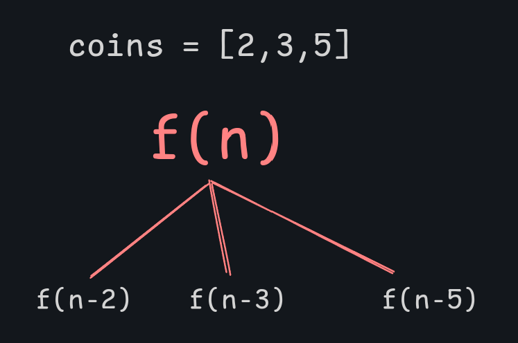
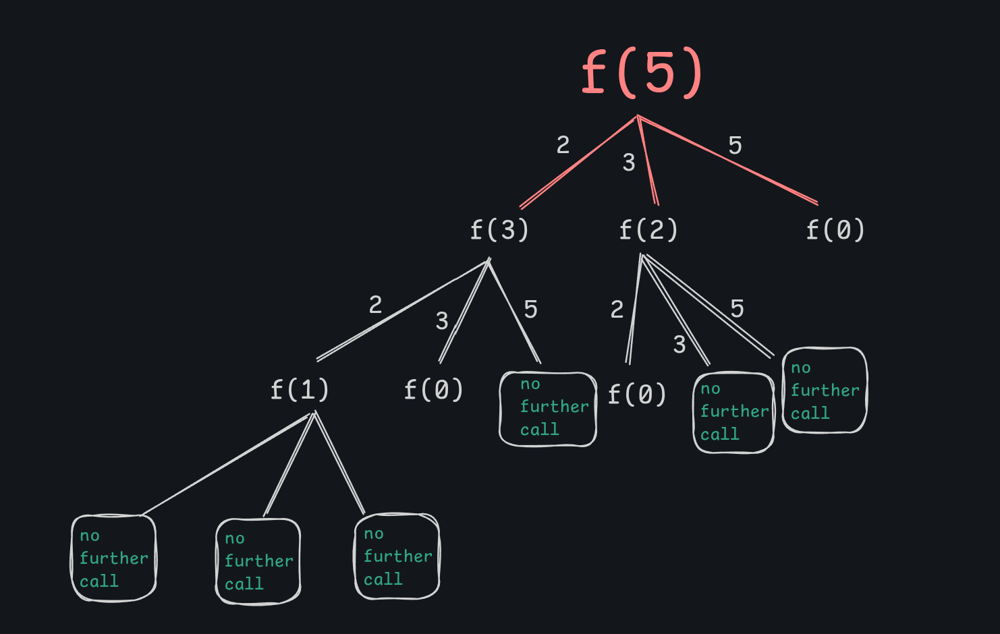
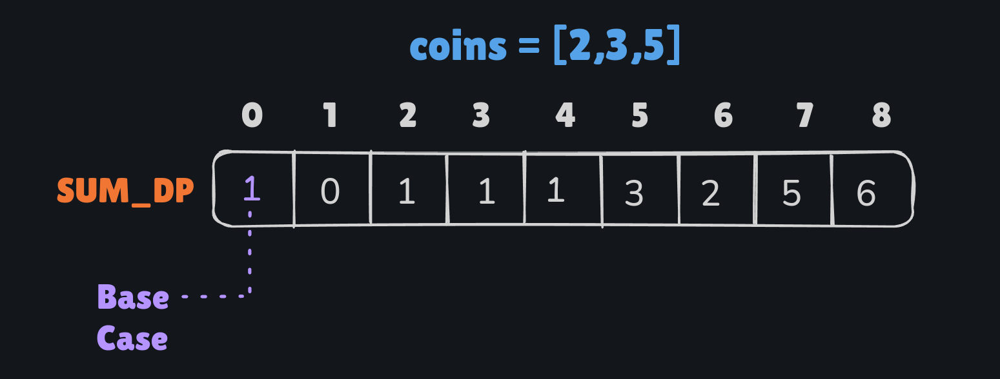

# Counting Number of Ways to construct a sum


Let's say we have few coins [2,3,5]<br>
we have to construct sum n = 5 <br>


<h2> Bruteforce Observation : </h2> 

If I choose 2 then I have to construct 5-2=3 now. 
If I choose 3 then I have to construct 5-3=2 now. 
If I choose 2 then I have to construct 5-5=0 now. 


see if I need to construct zero It has only one way that is choosing none, think it like this or just for sack of base case keep it 1.

<br>







</br>
<h2>Bottom Up</h2>

```plain

dp[0] = 1
for i from 1 to n 
    for each x of coins
        if x<= i :  dp[i]+= dp[i-x]
        
result = dp[n]

```
</br>



